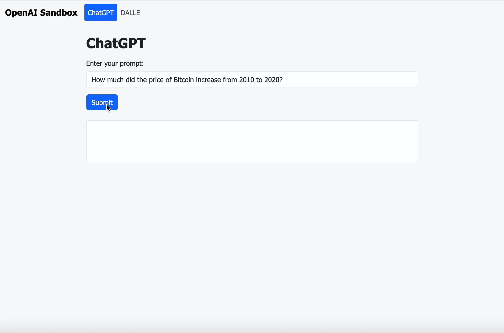

# simple-openai-playground
 
 This website aims to be a simple playground for the OpenAI API, containing two pages, one allowing the user to prompt GPT-3.5, and the other allowing the user to prompt DALLE.

 Developed using simple HTMl, JS, and CSS with Bootstrap for clean & simple styling, this codebase is great for beginners to get a feel for how OpenAI API queries can be sent and processed using JavaScript, and shown in a clean web UI. 
 
 ## How to Run Locally:
 
 1. Clone the repository and `cd` into it
 
 2. Open the repository in your preferred IDE 

 3. In the [script.js](./script.js) file, enter your OpenAI API key in the `openAIBearerToken` variable at the top
 
 4. (Recommended) Using Visual Studio Code's [Live Server](https://marketplace.visualstudio.com/items?itemName=ritwickdey.LiveServer) extension, run a live server from `index.html` and open the output URL in your browser.

## Demo

`index.html` _(ChatGPT demo)_

`dalle.html` _(DALLE demo)_

